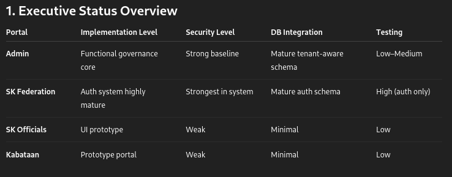

SK OnePortal Santa Cruz — Simplified Progress Report (April 21 2026)

1. Executive Status Overview

Interpretation

Production-leaning: Admin
Production-ready authentication layer: SK Federation
Prototype stage: SK Officials, Kabataan

2. Confidence Tag Meaning
Tag	Meaning
High	Verified directly in code/tests/schema
Medium	Implemented but partially limited
Low	Documentation-level or UI-only confirmation

3. Admin Portal Status
Authentication & Access Control

Implemented

Fortify login customization
2FA challenge flow
Lockout tracking
HTTPS + security headers
Role checks
Audit logging integration

Incomplete

Forgot/reset password backend logic still placeholder

DB tables used

users
login_attempts
sessions
admin_activity_logs
Account Governance System

Implemented lifecycle flows

Create
Update
Deactivate
Reset
Extend term
Federation & Officials filtering/search

Security controls

tenant boundary enforcement
ensure2fa middleware
policy/gate authorization
transactional lifecycle operations

DB relations

users → tenants
users → barangays
official_profiles → users
official_terms → official_profiles
logs → users / tenants
Audit Monitoring

Capabilities

View/filter admin audit logs
Read SK Federation auth audit logs
Tenant-aware monitoring

Architecture

AuditLogInterface abstraction
middleware-protected UI
Dashboard & Profile

Current state:

user-aware views
minimal orchestration logic
UI shell (not domain-driven module yet)

4. SK Federation Portal Status

This portal contains the most mature authentication stack in the entire monorepo ⭐

Authentication & Session Security

Implemented protections:

tenant-role validation
login lockouts
trusted device verification
suspicious login handling
email-verified device tracking
takeover OTP session conflict resolution
session heartbeat
Cloudflare Turnstile protection
feature flags
audit logging

Uses:

lockForUpdate

during takeover verification for concurrency safety.

Primary tables

users
tenants
sessions
sk_fed_login_attempts
trusted_devices
verified_devices
feature_flags
audit_logs
Password Reset Flow

Fully implemented:

scoped reset eligibility
password complexity validation
reuse protection
session invalidation
remember-token reset
throttling
Turnstile verification
Profile Module

Current behavior:

read-only profile
updates intentionally disabled

Reads:

users
official_profiles
barangays
Community Feed

Status:

Prototype UI only

Create-post:

Returns success redirect without persistence

Barangay Monitoring

Status:

Static computed analytics dashboards

No DB integration yet

Kabataan Monitoring (inside Federation portal)

Status:

View shell only

Federation Dashboard

Returns:

User-context view only

No business orchestration yet

5. SK Officials Portal Status

Prototype-level implementation ⚠️

Authentication

Current method:

Hardcoded credential pair

Session flag controls login state

Missing:

persistent identity
role checks
tenant enforcement
credential storage model
Core Modules Available (UI Only)

Routes exist for:

dashboard
profile
calendar
announcements
committees
programs
budget
KK profiling requests
ABYIP

Security inconsistency:

session('authenticated')
vs
auth middleware

Both used simultaneously

Risk: guard divergence

6. Kabataan Portal Status

Prototype-first architecture

Authentication

Behavior:

simulated login session
registration TODO
simulated email verification
simulated reset flow

Only real DB interaction:

exists:users,email

validation check

Homepage & About

Implemented:

Static feed

Modal-gated interactions

No persistence layer

Dashboard & Barangay Profile

Uses:

static arrays + session payload mapping

No database integration

Profile & Settings

Driven entirely by:

session data + mock participation datasets

Manual access control only

7. Cross-Portal Architecture Patterns
Strongest modular structure

Found in:

Admin
SK Federation

Uses:

provider-based loading
service-layer orchestration
migration modularization
Prototype-style controller design

Found in:

Kabataan
SK Officials
Federation non-auth modules

Characteristics:

static arrays
closure routes
thin validation
session-flag guards
Boundary enforcement

Admin includes script:

check-frontend-backend-boundary.sh

Explicit layering policy enforcement

8. Cross-Portal Security Comparison
Portal	Security Model
Admin	Middleware + role + tenant + audit
SK Federation	Strongest (devices, OTP takeover, heartbeat, Turnstile)
SK Officials	Session flag only
Kabataan	Session prototype only

9. Test Coverage Status
Portal	Coverage
SK Federation	Strong auth feature tests
Admin	Example test only
Kabataan	Example test only
SK Officials	Example test only

Federation tests cover:

login gating
email verification states
trusted devices
reset flow
throttling
takeover OTP
session heartbeat
concurrency handling

10. Static-Analysis Issues Detected
Kabataan

Profile controller:

withHeaders inference issue
SK Federation

Test suite:

$this->withSession inference issue (Pest)
Example tests (multiple portals)

Issue:

$this->get in closure context
Admin Auth Controller

Bug:

Standalone stray:

+

inside login flow

Kabataan Providers

Referenced but missing:

ChatbotServiceProvider

11. Confirmed Database Tables in Active Feature Paths

Validated schema coverage includes:

users
tenants
barangays
official_profiles
official_terms
login_attempts
admin_activity_logs
password_reset_tokens
sessions
sk_fed_login_attempts
sk_fed_auth_audit_logs
trusted_devices
verified_devices
feature_flags

12. Priority Next Steps
Quick Wins (1–2 days) ⚡
Complete Admin password reset backend OR disable exposed routes
Remove stray + in Admin auth controller
Fix missing ChatbotServiceProvider reference
Normalize SK Officials authentication guard usage
Add first lifecycle tests for Admin accounts module
Structural Improvements (1–2 sprints) 🧱
Replace prototype auth in Kabataan + SK Officials
Expand regression tests across portals
Convert static dashboards/feeds into repository-driven DB modules
Promote Federation monitoring modules to persistent analytics services